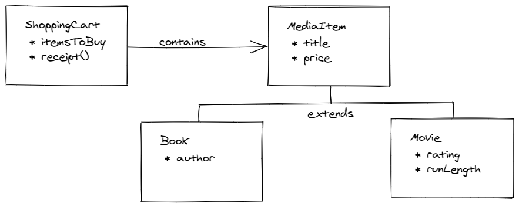
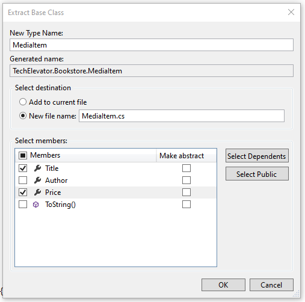

# Tutorial for inheritance

In this tutorial, you'll continue to build a bookstore application using inheritance. Due to the success of your previous bookstore application, the store is growing and looking to expand its product line. In addition to selling books, the store is going to start selling movies. In the future, the owners hope to expand into music and audio books, among other media.

You need to modify your application to handle movies, with the flexibility to add more product lines in the future.

To get started, open the project in Visual Studio. You'll start your work in the file `Book.cs`.

## Design

You need a new class to represent a `Movie`. A movie has properties for `title`, `rating`, `runLength`, and `price`. Recall that the `Book` class has properties `title`, `author`, and `price`.

An author doesn't apply to a movie, nor does a run-length apply to a book. Books and movies are similar in that they have a *title* and *price*. Any item the store sells needs to have these attributes.

Your job is to create a new *superclass* called `MediaItem`, which has `title` and `price` properties. `Book` *inherits from* `MediaItem` and adds an `author` property. A new class called `Movie` also inherits from `MediaItem`, adding all the movie-specific attributes.

Because `MediaItem` now represents a "thing to buy", the collection in your `ShoppingCart` class must also change from a list of `Book`s to a list of `MediaItem`s.

Your new class hierarchy looks like this:



Whenever you write code that uses inheritance, use the "is-a" test. Can you say that a book IS A media item, and that a movie IS A media item? Considering what the bookstore sells, these statements are true.

## Step One: Use `ToString()` for a string representation of `Book`

In the previous tutorial, you needed to represent a `Book` object in a printed receipt, so you created a method called `GetBookInfo()`, which returns details about a book as a `string`. The `ShoppingCart` class calls this when printing a receipt.

The `Object` class already defines a method for this purpose. The `ToString()` method exists to provide a string representation of any object, which is exactly what you did in the `GetBookInfo()` method.

Every class either directly or indirectly extends `Object`. If the class definition doesn't contain the `:` inheritance indicator, then the class directly extends `Object`. You can think of `Object` as being at the top of the class hierarchy, or the "ultimate superclass."

### Rename `GetBookInfo()` to `ToString()`

This means that your `Book` class IS A `Object`. So you can *override* `ToString()` in the `Book` class to provide a string representation of a book. Since you already have the code for this, you just need to rename that method.

In `Book.cs`, find the `GetBookInfo()` method near the bottom, and rename the method to `ToString()`:

```csharp
// Book.cs
// Return a string representation of this book
public override string ToString()
{
    return $"Title: {this.Title}, Author: {this.Author}, Price: ${this.Price}";
}
```

> Note that you must add the `override` modifier to indicate that you intend to override a method that's in a parent class. C# requires you to do this explicitly so that you don't accidentally name a method the same as a method in the parent.

Now in `ShoppingCart.cs`, inside the `GetReceipt()` method, change the call to the method `GetBookInfo()` into a call to the method `ToString()`:

```csharp
// ShoppingCart.cs
public string GetReceipt()
{
    ...
    foreach (Book book in this.booksToBuy)
    {
        receipt += book.ToString();
        receipt += "\n";
    }
	...
}
```

If you run the program, you get the same output as you saw in the previous tutorial:

```
Receipt
Title: A Tale of Two Cities, Author: Charles Dickens, Price: $14.99
Title: The Three Musketeers, Author: Alexandre Dumas, Price: $12.95
Title: Childhood's End, Author: Arthur C. Clark, Price: $5.99

Total: $33.93
```

### Remove the explicit call to `ToString()`

In the previous step, you renamed a method. However, now that you used the proper method, `ToString()`, you get an added bonus. You don't have call that method explicitly. When your code needs a string representation of your object, the C# compiler calls the object's `ToString()` method.

Try this—in the `ShoppingCart.GetReceipt()` method, remove the explicit call to `ToString()`:

```csharp
// ShoppingCart.cs
public string GetReceipt()
{
    ...
    foreach (Book book in this.booksToBuy)
    {
        receipt += book;		// ToString() explicit call removed
        receipt += "\n";
    }
	...
}
```

When you run the program again, you see the same output. That's because in the line `receipt += book;`, your code needed a string to represent `book`, so the C# compiler called `book.ToString()` implicitly.

## Step Two: Refactor the `Book` class into `MediaItem` and `Book`

Now you must *refactor* your book code. Refactoring means that you change the form of the code, but not the functionality. To refactor `Book` into a superclass and subclass, you need to:

1. Create the `MediaItem` superclass, and move the properties `title` and `price` as well as their getters and setters from `Book` into `MediaItem`.
2. Change `Book` so that it inherits from `MediaItem`. 
3. Remove the `Title` and `Price` properties from `Book`, since `Book` now *inherits* them from the superclass.
4. Change `ShoppingCart` to hold a list of `MediaItem` objects instead of `Book` objects.
5. Rename the variable `booksToBuy` to `itemsToBuy` to properly reflect that the bookstore sells more than books.

### Split the classes

Visual Studio includes some *refactoring tools* that can help you do this type of work. To split `Book` into a superclass and subclass, open `Book.cs`. Right-click on the `Book` class name  in the line `public class Book`, then select **Quick Actions and Refactorings...** from the menu that pops up. From the next menu, select **Extract base class....**

In the dialog that appears, type `MediaItem` as the **New type name**, and in the list, check the `Title` and `Price` properties. These are the members to remove from `Book` and add to the new superclass, `MediaItem`. Click the **OK** button:



> ### Note: What `Quick Actions and Refactorings` > `Extract base class` did
>
> You asked Visual Studio to refactor your code by extracting a superclass from the code so that you now have a superclass (`MediaItem`) and a subclass (`Book`). Look at your code to see the changes.
>
> * See the new file, `MediaItem.cs`, which contains a new class, `MediaItem`. This class contains the properties: `Title` and `Price`.
> * Look in `Book.cs` and notice that:
>    * `Book` now *inherits from* `MediaItem`.
>    * `Title` and `Price` no longer exist in the subclass.

### Modify the collection in `ShoppingCart`

`ShoppingCart` has a private member variable called `booksToBuy`. To allow your shopping cart to hold more than books, you must do two things:

1. Change the type of `booksToBuy` from `List<Book>` to `List<MediaItem>`.
2. Change the name of `booksToBuy`, since that name no longer accurately reflects what the list holds.

First, rename the variable using refactor tools. Right-click on the variable `booksToBuy` in its declaration, then select **Rename...**. Then, without clicking anything else, type `itemsToBuy`.

Visual Studio replaces the variable name not only on the line you're typing in, but for every usage of the variable `booksToBuy`. Press **Enter** when you finish typing to accept the change.

Now, change the type in the declaration from `List<Book>` to `List<MediaItem>`:

```csharp
// ShoppingCart.cs
private List<MediaItem> itemsToBuy = new List<MediaItem>();
```

Change the `Add()` method to reflect the type of item to add:

```csharp
// ShoppingCart.cs
public void Add(MediaItem itemToAdd)
{
    itemsToBuy.Add(itemToAdd);
}
```

Modify the two foreach loops to reflect the type change. First, modify the derived property`TotalPrice`:

```csharp
// ShoppingCart.cs
foreach (MediaItem item in this.itemsToBuy)
{
    total += item.Price;
}
```

Next, modify the `GetReceipt()` method:

```csharp
// ShoppingCart.cs
foreach (MediaItem item in this.itemsToBuy)
{
    receipt += item;
    receipt += "\n";
}
```

Now run your program. You see the exact same output you saw originally.

You've done a lot of work here, and to an outside observer, nothing has changed. This is *exactly* what refactoring is about. You haven't changed what the code *does*. But you have changed *how it's done*. You've made your code more adaptable.

## Step Three: Add the `Movie` class

This adaptability becomes apparent when you add the `Movie` class.  `Movie` is another subclass of `MediaItem`.

### Add a class

Add a new class by right-clicking on the `Bookstore` project in Solution Explorer and selecting **Add -> Class...**. In the dialog, type "Movie" and press **Enter**. Visual Studio creates a new file called `Movie.cs` which contains the new class.

### Extend `MediaItem`

In `Movie.cs`, make the class _public_ and update the class definition so `Movie` inherits from `MediaItem`:

```csharp
public class Movie : MediaItem
{
}
```

### Add properties and methods

In addition to a title and a price—which `Movie` inherits from `MediaItem`—movies have a rating and run-length. Add these properties with their getters and setters:

```csharp
// Movie.cs
public class Movie : MediaItem
{
    public string Rating { get; set; }
    public int RunLength { get; set; }
}
```

### Add a constructor

While not necessary, constructors make it convenient to create and initialize an object in a single line of code. It's a good idea to create one or more.

Add a constructor to the `Movie` class to initialize a movie at creation time:

```csharp
// Movie.cs
public Movie(string title, string rating, int runLength, decimal price)
{
    Title = title;
    Rating = rating;
    RunLength = runLength;
    Price = price;
}
```

### Override `ToString()`

Remember that `ToString()` is the conventional way to create a string representation of any object. You need this so that on the receipt, it's clear what movie is in the cart.

In `Movie.cs`, override the `ToString()` method:

```csharp
// Movie.cs
public override string ToString()
{
    return $"Title: {this.Title}, Rating: {this.Rating}, Time: {this.RunLength}, " +
                $"Price: ${this.Price}";
}
```

That's all you need to do to sell movies in your bookstore. Because you created a general class to represent any purchasable item in the store, adding a specific type of item such as a movie doesn't take a lot of effort.

### Buy some movies

Now you can create a new movie and add it to the shopping cart. Do this in `Program.cs`, prior to printing the receipt:

```csharp
// Program.cs
// Add some new movies and purchase them
Movie toyStory = new Movie("Toy Story", "G", 81, 19.99M);
shoppingCart.Add(toyStory);

// Shirley, you can't be serious!
Movie airplane = new Movie("Airplane!", "PG", 88, 14.99M);
shoppingCart.Add(airplane);

Console.WriteLine(shoppingCart.GetReceipt());

```

In the output window, you see a receipt that shows *both* books and movies:

```
Welcome to the Tech Elevator Bookstore

Receipt
Title: A Tale of Two Cities, Author: Charles Dickens, Price: $14.99
Title: The Three Musketeers, Author: Alexandre Dumas, Price: $12.95
Title: Childhood's End, Author: Arthur C. Clark, Price: $5.99
Title: Toy Story, Rating: G, Time: 81 minutes, Price: $19.99
Title: Airplane!, Rating: PG, Time: 88 minutes, Price: $14.99

Total: $68.91
```

## Next steps

If you want further practice, implement another product line in your bookstore. For example, add music as a new type of media item. Then open `Bookstore.cs`, and add some music to your shopping cart.

> Hint: repeat step three, substituting your new class and its properties for `Movie`.

## Summary

In this tutorial, you:

* Used inheritance by refactoring a class into a superclass and subclass.
* Created a new class that inherits from an existing class.
* Implemented `ToString()` to override the method in `Object`.
