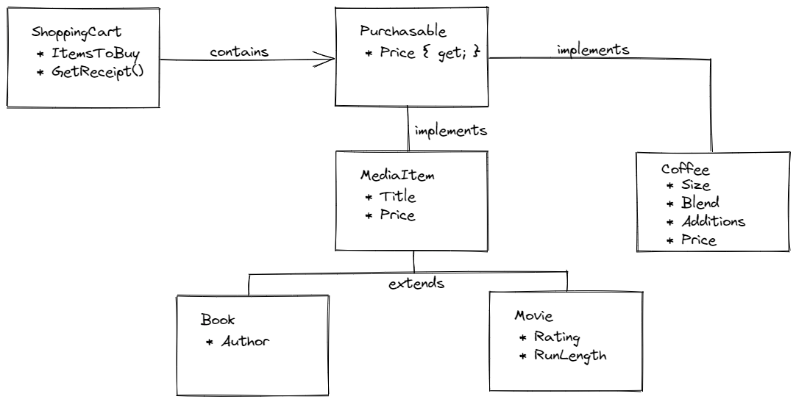

# Tutorial for polymorphism

In this tutorial, you'll continue to build a bookstore application, using polymorphism to expand the store into an unrelated business.

Your bookstore application has allowed the store to expand its product line and achieve great success. The bookstore is now selling books and movies, and has plans to sell more media in the future.

With great success comes more great ideas. The owners have informed you that the stores will open cafes to sell coffee, tea, and other food and drink items. You need to modify your application to handle the purchase of food and drinks in addition to books and movies.

To get started, open the `PolymorphismTutorial.sln` solution in Visual Studio.

## Design

You could add food and drink items as child classes of `MediaItem`. However coffee, tea, and pastries don't pass the _is a_ test as media items. A scone _is NOT a_ media item. So class inheritance isn't a good choice here.

Instead, you define what it takes to make something *purchasable*. For this store, to be purchasable an item must have a price.

You're going to define an **interface** called `IPurchasable`. An interface defines a "contract" of properties and methods that any class implementing the interface *must* define.

The `IPurchasable` interface you write has one property: `Price`. You store can sell any item that implements the "contract" established by the `IPurchasable` interface.

This means that the `MediaItem` that you previously defined must *implement* the `IPurchasable` interface, and any new cafe items must also implement `IPurchasable`.

Your shopping cart must now contain "purchasables"; that is, any class that implements the `IPurchasable` interface.

The new class hierarchy looks like:



In the diagram, `Coffee` is the only cafe item defined, but you can add many others, as long as those classes implement the `IPurchasable` interface.

## Step One: Support the `IPurchasable` interface

The first thing to do is *refactor* your existing code to support your new design. Recall that refactoring re-structures your code without changing its function.

### Create the `IPurchasable` interface

Add a new interface by right-clicking on the `Bookstore` project in Solution Explorer and selecting **Add > New Item...**. In the dialog, select `Interface` and type "IPurchasable" and press **Enter**. Visual Studio creates a new file called `IPurchasable.cs`, and declares the interface inside it.

In `IPurchasable.cs`, add the _public_ access modifier and add the following to `IPurchasable`:

```csharp
// IPurchasable.cs
public interface IPurchasable
{
    decimal Price { get; }
}
```

Notice that there's no access modifier and only a `get` associated with `Price`. This says that all classes that implement `IPurchasable` must have a "getter" for `Price`. 

Remember that C# auto-properties have "getters" and "setters" automatically defined by the `get;` and `set;` that return the value or set the value of the property. These are technically methods under the hood and are a shortcut to writing something more verbose. Methods defined in an interface *have no body*. Interfaces define the method *signatures*, but don't include the *implementation* (body) of the method. That's the job of the class which implements the interface.

### Implement `IPurchasable` in `MediaItem`

A media item (a book or a movie) is purchasable, so implement the new interface in the `MediaItem` class. In `MediaItem.cs`, change the class declaration:

```csharp
// MediaItem.cs
public class MediaItem : IPurchasable
{
    ...
```

Since `MediaItem` already has a `Price` getter, there's nothing else you need to do. `MediaItem` now completely implements the `IPurchasable` interface.

### Change `ShoppingCart` to hold "purchasables"

Currently the shopping cart contains a list of media items to purchase. Change that to a list of `IPurchasable`. This means the shopping cart holds a *list of items that are purchasable*.

Change the declaration of `itemsToBuy`, as well as the places in the code that refer to the list:

```csharp
// ShoppingCart.cs

// *** Change from MediaItem to IPurchasable
private List<IPurchasable> itemsToBuy = new List<IPurchasable>();

public decimal TotalPrice
{
    get
    {
        decimal total = 0.0M;
        // *** Change from MediaItem to IPurchasable
        foreach (IPurchasable item in this.itemsToBuy)
        {
            total += item.Price;
        }
        return total;
    }
}

// *** Change from MediaItem to IPurchasable
public void Add(IPurchasable itemToAdd)
{
    itemsToBuy.Add(itemToAdd);
}

public string GetReceipt()
{
    string receipt = "Receipt\n";
    // *** Change from MediaItem to IPurchasable
    foreach (IPurchasable item in this.itemsToBuy)
    {
        receipt += item;
        receipt += "\n";
    }
    receipt += "\nTotal: $" + this.TotalPrice;
    return receipt;
}
```

When you run the program now, you get the same output as you had before making these changes. You've refactored the code so that the shopping cart can hold any kind of purchasable item:

```
Welcome to the Tech Elevator Bookstore

Receipt
Title: A Tale of Two Cities, Author: Charles Dickens, Price: $14.99
Title: The Three Musketeers, Author: Alexandre Dumas, Price: $12.95
Title: Childhood's End, Author: Arthur C. Clark, Price: $5.99
Title: Toy Story, Rating: G, Time: 81 minutes, Price: $19.99
Title: Airplane!, Rating: PG, Time: 88 minutes, Price: $14.99

Total: $68.91
```

## Step Two: Define a purchasable cafe item

Now create your first cafe item to sell. You can create many types of cafe items for purchase, but start with `Coffee`.

In the Solution Explorer window, right-click the `Bookstore` project and select **Add > Class...**. In the dialog, type "Coffee" and press **Enter**. Visual Studio creates a new file called `Coffee.cs` which contains the new class.

Change the class declaration to indicate that `Coffee` is `public` and implements `IPurchasable`:

```csharp
// Coffee.cs
public class Coffee : IPurchasable
```

In the class, define the properties for `Coffee`: `Size`, `Blend`, `Additions`, and `Price`, as well as the `Add()` method to add additions to the `Additions` list:

```csharp
// Coffee.cs
public string Size { get; set; }
public string Blend { get; set; }
public List<string> Additions { get; private set; } = new List<string>();
public decimal Price { get; set; }

public void Add(string addition)
{
    Additions.Add(addition);
}
```

> Note: Visual Studio may add `using` statements for the namespaces you use automatically as you add the properties. If it doesn't, make sure you include this before your `Coffee` class declaration:

```csharp
using System.Collections.Generic;
```

Notice that `public decimal Price { get; set; }` satisfies the "contract" for the `IPurchasable` interface that said there must be a "getter" for `Price`.

For coffee to display well on a receipt, implement the `ToString()` override:

```csharp
// Coffee.cs
public override string ToString()
{
    return $"{Size} coffee, {Blend} ({string.Join(", ", Additions)}). Price: ${Price}";
}
```

Finally, for convenience, add a constructor to `Coffee`:

```csharp
// Coffee.cs
public Coffee(string size, string blend, string[] additions, decimal price)
{
    Size = size;
    Blend = blend;
    Additions.AddRange(additions);
    Price = price;
}
```

## Step Three: Purchase coffee and books

Now that you've added coffee as a purchasable item, you can add some to your cart to make a purchase. Do this in `Program.cs`, after you have added media items to the cart:

```csharp
// Program.cs
// Have a cuppa jo!
Coffee myCoffee = new Coffee("Extra-large", "Dark Roast", new string[] { "Creme" }, (decimal)3.99);
Coffee myFriendsCoffee = new Coffee("Medium", "House Blend", new string[] { "Soy milk", "Sugar" }, (decimal)2.79);
shoppingCart.Add(myCoffee);
shoppingCart.Add(myFriendsCoffee);

Console.WriteLine(shoppingCart.GetReceipt());
}
```

When your receipt prints, you see that your program handled these seemingly different types of items in a consistent way, and printed a consolidated receipt.

```
Welcome to the Tech Elevator Bookstore

Receipt
Title: A Tale of Two Cities, Author: Charles Dickens, Price: $14.99
Title: The Three Musketeers, Author: Alexandre Dumas, Price: $12.95
Title: Childhood's End, Author: Arthur C. Clark, Price: $5.99
Title: Toy Story, Rating: G, Time: 81 minutes, Price: $19.99
Title: Airplane!, Rating: PG, Time: 88 minutes, Price: $14.99
Extra-large coffee, Dark Roast (Creme). Price: $3.99
Medium coffee, House Blend (Soy milk,Sugar). Price: $2.79

Total: $75.69
```

> Polymorphism is the principle behind this. The word literally means "many forms", and what you've shown is that there are many forms of purchasable items. Drinks are significantly different than books, but your program was able to treat these items similarly when it came to making a purchase.

## Summary

In this tutorial, you learned how to:

* Define an interface that describes some common features that otherwise different objects may have.
* Implement an interface inside a class by implementing the methods defined on that interface.
* Polymorphically use disparate types of objects in a similar way by calling methods of an interface.
