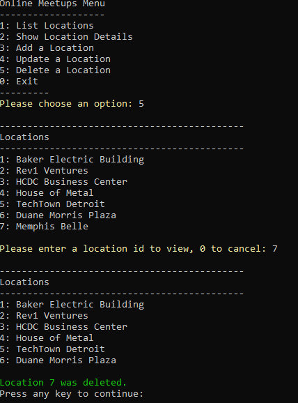

# Web Services POST, PUT, DELETE Tutorial (C#)

In this tutorial, you'll extend the Meetup Locations example from the first day by adding the capability to:

* Add a new Location (`POST`)
* Modify an existing Location (`PUT`)
* Remove a Location (`DELETE`)
* Capture and handle HTTP exceptions

When complete, this produces a full **C**reate **R**ead **U**pdate **D**elete (CRUD) console Web API client application.

## Step One: Start the server

Before you start, make sure that the web API is up and running. First, change directories into the `./server/` folder.

Next, run the command `npm install` to install any dependencies. You won't need to do this on any subsequent run.

While still in the command line, run the command `npm start` to start the json-server application. If there aren't any errors, you'll see the following, which means that you've successfully set up your web API:

```
 \{^_^}/ hi!

  Loading data-generation.js
  Done

  Resources
  http://localhost:3000/locations

  Home
  http://localhost:3000

  Type s + enter at any time to create a snapshot of the database
```

When json-server is running on port 3000, no other applications—including other copies of json-server—are able to use port 3000. To free up the port, be sure to stop json-server when you're finished with this tutorial. You do that by selecting the terminal where you typed `npm start` and pressing `Ctrl+C`. Or if you've already closed that terminal, open a new terminal and type:

```
taskkill -T -F -IM node.exe
```

or

```
npx kill-port 3000
```

In this tutorial, you'll modify data on the server. As you're working, you may come across a situation where you want to reset the data. To do this, first stop the server with `Ctrl+C`, then restart it with `npm start`.

## Step Two: Review the starting code

This tutorial code is similar to the tutorial code you worked on from the previous unit.

In `LocationApp.cs`, three new menu options and methods have been added to add, update, and delete a location. Three methods have also been added to `LocationApiService.cs` for these same operations. You'll add code to complete the `AddLocation()`, `UpdateLocation()`, and `DeleteLocation()` methods in `LocationApiService.cs`. If you review the `GetAllLocations()` and `GetDetailsForLocation()` methods, you'll see that they're similar to the `GET` code you wrote the previous day.

You may notice one other change to `LocationApiService.cs`. In the previous tutorial, every method created a new `RestClient` to make the API call. In this tutorial, that code has been refactored so that only one `RestClient` is created in the constructor and is used by each of the methods to call an API endpoint.

Before you make any changes, run the program to make sure that menu options **1** and **2** work as expected. If you select one of the three new options, you'll get a message stating that the method isn't implemented yet. You'll implement those methods in this tutorial.

## Step Three: Add a location with POST

Open the `LocationApiService.cs` file and find the `AddLocation()` method:

```csharp
public Location AddLocation(Location newLocation)
{
    throw new NotImplementedException("The api method has not yet been implemented.");
}
```

The code to make a `POST` request with RestSharp is similar to the code you write to make `GET` requests. First, define a new `RestRequest` object, passing it the API endpoint you want to invoke:

```csharp
RestRequest request = new RestRequest("locations");
```

Then, you need to attach the data that you want to send with the `POST` request. You can accomplish this by passing the `newLocation` object to the `AddJsonBody()` method of the request you defined:

```csharp
request.AddJsonBody(newLocation);
```

Now you're ready to make the `POST` request. As with `GET` requests, you use a type parameter to let RestSharp automatically serialize the request data, and deserialize the response data. Instead of using `Get()`, you use the `Post()` method of the `RestClient`:

```csharp
IRestResponse<Location> response = client.Post<Location>(request);
```

Finally, return the deserialized response data, and remove the original `throw...` if you haven't already:

```csharp
return response.Data;
```

The calling code in `LocationApp` checks that the return value isn't null as a sign of success.

The `AddLocation()` method looks like this when you're done:

```csharp
public Location AddLocation(Location newLocation)
{
    RestRequest request = new RestRequest("locations");
    request.AddJsonBody(newLocation);
    IRestResponse<Location> response = client.Post<Location>(request);
    return response.Data;
}
```

Run the application now and select option **3: Add a Location**. Follow the on-screen instructions for entering the location data and press **Enter** when you're done:


When you submit the data, the program re-retrieves the list of all locations and displays them. You'll see the location you added at the bottom of the list:


## Step Four: Modify a location with PUT

Next, you'll modify the `UpdateLocation()` method. This method is like the `AddLocation()` method, but it's passed an existing location—`locationToUpdate`—rather than a brand new location.

Start again by creating a `RestRequest` object. This time, you'll pass it the endpoint with a `/` and the location ID appended to it:

```csharp
RestRequest request = new RestRequest($"locations/{locationToUpdate.Id}");
```

The URL is different because you're using the HTTP `PUT` method to update an existing record, and the ID of the record you want to update is given in the URL. Since you have a `Location` object, you'll use the `Id` property of it to append to the URL.

Like with `POST` requests, you attach the data you want to send with `AddJsonBody()`:

```csharp
request.AddJsonBody(locationToUpdate);
```

Next, send the request using the `Put()` method of the `RestClient`. Be sure to use the type parameter so RestSharp can serialize the request data and deserialize the response data for you:

```csharp
IRestResponse<Location> response = client.Put<Location>(request);
```

Finally, return the deserialized response data, and remove the original `throw...` if you haven't already:

```csharp
return response.Data;
```

Like with `AddLocation()`, the calling code in `LocationApp.cs` checks that the return value isn't null as a sign of success.

The `UpdateLocation()` method looks like this when you're done:

```csharp
public Location UpdateLocation(Location locationToUpdate)
{
    RestRequest request = new RestRequest($"locations/{locationToUpdate.Id}");
    request.AddJsonBody(locationToUpdate);
    IRestResponse<Location> response = client.Put<Location>(request);
    return response.Data;
}
```

Run the application now. Select option **4: Update a Location**, and enter the ID of the location you want to update. Similar to the steps for adding a location, follow the on-screen instructions for entering the location data and press **Enter** when done:


When you submit the data, the program re-retrieves the list of all locations and displays them. If you entered a new name for the location you updated, you'll see the new name in the list:


You can also use menu option 2 to view the details of your updated location.

## Step Five: Delete a location with DELETE

Next, you'll modify the `DeleteLocation()` method. Notice that the parameter for the method is an `int` and not a `Location` object. Similar to updating a location, you supply the ID of the location in the URL; however, you don't need to send any other data.

Like the update method, start off with a `RestRequest` object, appending a `/` and `locationId` to the URL:

```csharp
RestRequest request = new RestRequest($"locations/{locationId}");
```

Since `DELETE` methods don't receive or send data, there's nothing to attach and a type parameter isn't required. Create the response:

```csharp
IRestResponse response = client.Delete(request);
```

Since there's no data to receive and nothing to `return` to the calling code, you'll return a `bool` indicating success.

The completed `DeleteLocation()` method looks like this when you're done:

```csharp
public bool DeleteLocation(int locationId)
{
    RestRequest request = new RestRequest($"locations/{locationId}");
    IRestResponse response = client.Delete(request);
    return true;
}
```

Run the application now. Select option **5: Delete a Location**, and enter the ID of the location you want to delete. When you press **Enter**, the program re-retrieves the list of all locations. You shouldn't see the location you deleted:



Run the application and execute each menu item. If you followed the instructions, the application works as expected. If you encounter any issues, go back and review the previous steps.

## Step Six: Test your application

Now run the application and select option **4** to update a location. Choose location ID **999**. Enter the new information:


The program is erroneously reporting success to the user, even though there's no location with the ID 999. Your code must not assume success when making API calls.

In the following steps, you'll add error checking into your API service to provide better information to the caller.

## Step Seven: Add checking for HTTP errors

The particular method that's causing the issue is `GetDetailsForLocation()`. Take a look at the method in the `LocationApiService.cs` file:

```csharp
public Location GetDetailsForLocation(int locationId)
{
    RestRequest requestOne = new RestRequest($"locations/{locationId}");
    IRestResponse<Location> response = client.Get<Location>(requestOne);
    return response.Data;
}
```

The code appends the location ID to the URL, resulting in `locations/999`.

Take a look at the output from the console window where you're running the json-server. You can see each request that's made along with the response code:


The server returns a `404` because there's no location with that ID and no data to return. RestSharp still tries to deserialize the response into the type you specify, so it returns an empty object which the application still tries to use, resulting in the output you saw in Step Six.

In the `GetDetailsForLocation()` method, remove the `return` statement, and add this `if` block:

```csharp
if (response.ResponseStatus != ResponseStatus.Completed)
{
    throw new Exception("An error occurred - unable to reach the server.", response.ErrorException);
}
```

This code first checks that a response wasn't received by checking for `ResponseStatus` not being equal to `Completed`. RestSharp only sets the `ResponseStatus` to `Completed` if a response is received. If a response isn't received, it throws an exception with `response.ErrorException` as the inner exception. The error message "An error occurred - unable to reach the server." prints to the console.

But that's not enough—you did receive a response, and it was a `404`. Add this `else if` block after the `if`:

```csharp
else if (!response.IsSuccessful)
{
    throw new Exception("An error response was received from the server. The status code is " + (int)response.StatusCode);
}
```

The `IsSuccessful` property contains `true` if the response code is 200-299. It's `false` for status codes that indicate an error, including `404`. This code also throws an exception, but `response.ErrorException` isn't available for this type of error. The error message "An error response was received from the server. The status code is 404" prints to the console.

Finally, add an `else` block to return the deserialized response.

```csharp
else
{
    return response.Data;
}
```

Now run the application again and try to update location 999 again. You'll see this output in the console:

```
An error response was received from the server. The status code is 404
```

Try shutting down json-server and see how the error message changes when you try to interact with the API. Re-start the server before the next step.

## Step Eight: Refactor error checking

You need to add this error handling to all the API methods. Instead of copying and pasting the same code in many places, you can create a method just for error checking. Given a `RestResponse`, it checks for errors and throws an exception if there's one. Otherwise, the method ends silently.

Add this method near the bottom of `LocationApiService`:

```csharp
private void CheckForError(IRestResponse response)
{
    if (response.ResponseStatus != ResponseStatus.Completed)
    {
        //response not received
        throw new Exception("An error occurred - unable to reach the server.", response.ErrorException);
    }
    else if (!response.IsSuccessful)
    {
        //response indicating an error
        throw new Exception("An error response was received from the server. The status code is " + (int)response.StatusCode);
    }
    return;
}
```

Now replace the error-checking code in `GetDetailsForLocation()` with a call to `CheckForError()`:

```csharp
public Location GetDetailsForLocation(int locationId)
{
    RestRequest requestOne = new RestRequest($"locations/{locationId}");
    IRestResponse<Location> response = client.Get<Location>(requestOne);
    CheckForError(response);
    // If CheckForError did not throw, success
    return response.Data;
}
```

If you have time, implement a similar call to `CheckForError()` in the other methods that call an API endpoint.

## Summary

In this tutorial, you learned how to:

* Use the HTTP `POST` Web API call to add a new Location
* Use the HTTP `PUT` Web API call to modify a new Location
* Use the HTTP `DELETE` Web API call to delete a new Location
* Use exception handling for HTTP errors

### Don't forget to stop json-server

When you're done with the tutorial, remember to stop json-server. Directions are under Step One.

