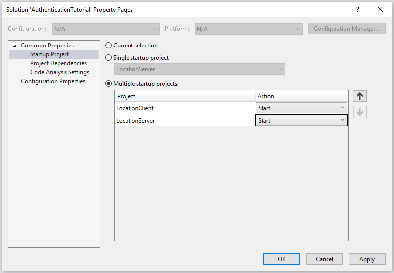
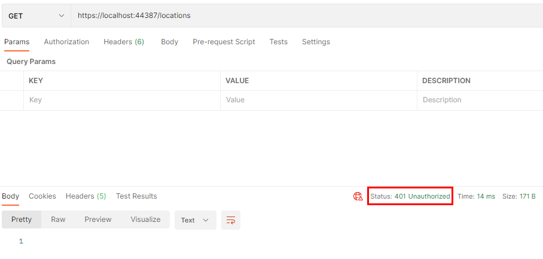
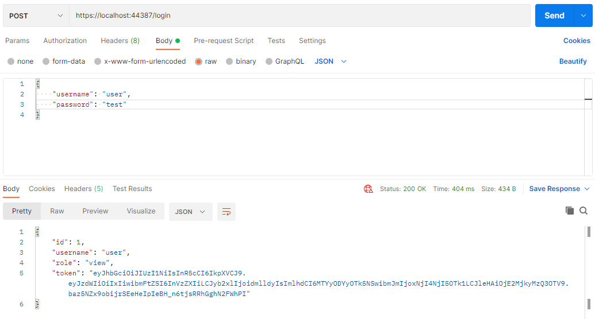
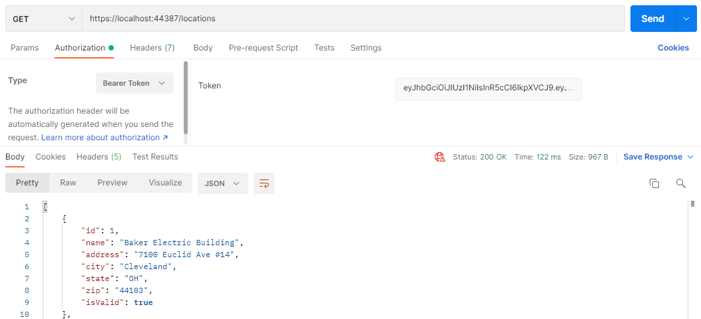

# Authentication tutorial (C#)

In this tutorial, you'll continue working on an application that uses meetup locations as the data model. You'll add the ability to log in to the client application and send the authentication token with any request.

## Step One: Open solution and explore starting code

Before you begin, open the `AuthenticationTutorial.sln` solution. The solution contains both the server and client projects from the previous days. Review both projects. The code should look familiar to you as it's a continuation of the previous tutorials.

### Set startup projects

Since both applications are included in the solution, you'll have to configure the solution to run both projects simultaneously. In Visual Studio, right-click the solution and select **Set Startup Projects...** In the window that appears, select **Multiple startup projects** and set both "LocationServer" and "LocationClient" to have the action, **Start**.



### Server

The server application picks up where you left off in the previous tutorial. There's a new folder called `Security` that contains the code needed to implement authentication.

### Client

If you run the application, you'll notice the new menu option, option 6, for logging in:

```
Online Meetups Menu
-------------------
1: List Locations
2: Show Location Details
3: Add a Location
4: Update a Location
5: Delete a Location
6: Log in
0: Exit
---------
Please choose an option:
```

If you have time, examine the code that makes this login feature work.

There's a new file in this project called `Services/AuthenticatedApiService.cs`. This class is the base class for `LocationApiService`. So, `LocationApiService` **is-a** `AuthenticatedApiService`.

Open `AuthenticatedApiService.cs` and notice these two lines of code at the top of the class:

```csharp
protected ApiUser user = new ApiUser();

public bool LoggedIn { get { return !string.IsNullOrWhiteSpace(user.Token); } }
```

The `ApiUser` class has three properties: `Username`, `Token`, and `Message`. These fields map to the expected responses from the login endpoint of the server—`Username` and `Token` are returned for successful logins, and `Message` is returned for unsuccessful logins.

The `protected ApiUser user` is declared here to store the login token for requests. The `LoggedIn` property shares the login status with `LocationApp.cs` so it can change "Log in" to "Log out" on the menu.

Next, look at the `Login()` method of `AuthenticatedApiService.cs`:

```csharp
public bool Login(string submittedName, string submittedPass)
{
    LoginUser loginUser = new LoginUser { Username = submittedName, Password = submittedPass };
    RestRequest request = new RestRequest("login");
    request.AddJsonBody(loginUser);
    IRestResponse<ApiUser> response = client.Post<ApiUser>(request);

    CheckForError(response, "Login");
    user.Token = response.Data.Token;

    return true;
}
```

If you successfully log in, you'll receive an authentication token in `response.Data.Token`. Recall that `response.Data` is the deserialized object from the API response. You'll take that token and set it to the `Token` property of the `protected ApiUser user` property in the class.

## Step Two: Run the applications

Now that you've set up your projects in Visual Studio and reviewed the starting code, run both of them to make sure everything works. It's best to make sure the application runs before adding anything new to it.

## Step Three: Test the REST API in Postman

After starting the server application, you'll need to test the REST API in Postman before writing any client code. Open Postman and try to get a list of locations by visiting `https://localhost:44387/locations`. This and every request mapping in the `LocationsController` returns a `401 Unauthorized` response.



Before sending any requests to the API, you need to log in and then use the authentication token that's sent back to you in any subsequent requests. Start by sending a `POST` request to `/login` with a JSON object with `username` and `password` fields. There's a user in the system with a username of `user` and a password of `test`.



> Note: If you send a bad username and password, what happens?

The response is a JSON object with the token as the value for the key `token`. You want to copy everything inside the double quotes because this is your authentication token. Now you can go back to the `GET` locations request that failed.

Under "Authorization", select the type `Bearer Token` and paste your token into the token field. This time, you'll pass authentication and receive a list of locations.



## Step Four: List all locations

Now that you've tested the API using Postman, you should know what you need to do in the client. You'll need to log in using the client application, store the authentication token, and then pass that token in an authorization header each time you make a call to the API.

Start by running the client application and selecting option 1 to list all of the locations. As expected, you receive a `401 Unauthorized` response:

```
Please choose an option: 1
Authorization is required and the user has not logged in.
```

### Location service

Open `LocationApiService.cs` and locate the `GetAllLocations()` method. To pass the authentication token, you need to create a new `JwtAuthenticator` instance, passing it the `user.Token` that was saved during the `Login()` method. Once you've created the `JwtAuthenticator`, set it to the `client.Authenticator` property. _RestSharp_ automatically sets the `Authorization` HTTP header with the token and type:

```csharp
public List<Location> GetAllLocations()
{
    RestRequest request = new RestRequest("locations");
    if (!string.IsNullOrWhiteSpace(user.Token)) // make sure Token isn't null or empty
    {
        JwtAuthenticator jwt = new JwtAuthenticator(user.Token);
        client.Authenticator = jwt;
    }
    IRestResponse<List<Location>> response = client.Get<List<Location>>(request);
    CheckForError(response, "Get all locations");
    // success
    return response.Data;
}
```

> Note: If Visual Studio didn't automatically add the `using RestSharp.Authenticators;` at the top of the file, make sure to add that line manually.

Run the client application, log in, and then try to list all of the locations.

## Step Five: Refactor authorization

You now know that you must add the `Authentication` header before you make any API call. But do you need to add these same lines of code to all the methods which call an endpoint?

Whenever you start to duplicate code, ask yourself, "Is there an opportunity to refactor this?" The answer is usually, "yes."

In `AuthenticatedApiService`, a `RestClient` is declared `static`, which means that the same instance is used every time one of the methods on `AuthenticatedApiService` is called. Because of this, if you set the `Authenticator` property on this client at the time of login, the `Authentication` header is sent with every request.

Remove the code you added to `GetAllLocations()` in Step Four.

Then add the same code to the `AuthenticatedApiService.Login()` method:

```csharp
public bool Login(string submittedName, string submittedPass)
{
    LoginUser loginUser = new LoginUser { Username = submittedName, Password = submittedPass };
    RestRequest request = new RestRequest("login");
    request.AddJsonBody(loginUser);
    IRestResponse<ApiUser> response = client.Post<ApiUser>(request);
    CheckForError(response, "Login");
    user.Token = response.Data.Token;
    // Set the token in the Authentication header of the client
    client.Authenticator = new JwtAuthenticator(user.Token);

    return true;
}
```

Now, you can re-run your application and see that you get successful responses for all menu options after you log in.

## Step Six: Logout

If you log out of the application using option 6 and then try to get locations using option 1, you'd expect to be denied with a "not authenticated" message. However, the call succeeds and you get a list of locations.

To properly log out, you need to cause the `RestClient` to "forget" its token, so it no longer sends the `Authentication` header to to server.

In `AuthenticatedApiService.Logout()` add code to delete the authentication header from the client:

```csharp
public void Logout()
{
    user = new ApiUser();
    // Drop the token in the client so no Authentication header is included
    client.Authenticator = null;
}
```

Now run the application, log in, and show locations. Then log out and try to show locations again. This time you'll see the authentication error you expected.

## Summary

In this tutorial, you learned:

- How to test a secure API using Postman
- How to retrieve a JWT from an API
- How to send an authentication token using RestSharp
